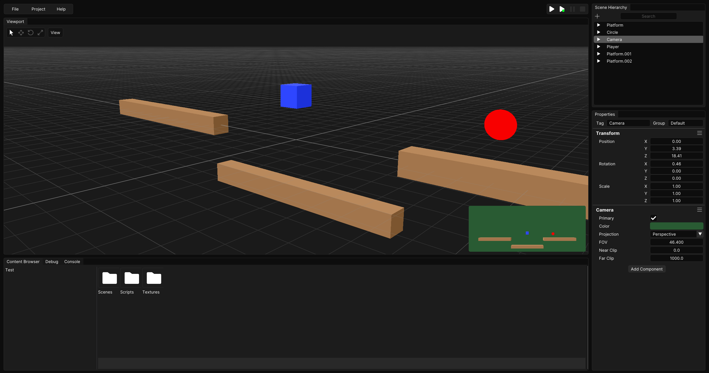

# Locus Game Engine
Locus is an open-source 2D/3D game engine written in C++ for Windows. The engine currently uses OpenGL but Vulkan and other graphics APIs may be implemented in the future.

## Features
Trello: https://trello.com/b/NNDPkCjF/locus-kanban
- Integrated editor GUI
- Scene runtime controls
- Scene graph: Parent-Child relationships
- Viewport Gizmo
- Orthographic and perspective runtime cameras
- 2D physics system
- Sprite rendering

Example GUI:

## How to Build
Requirements: Visual Studio 2022, Python3

#### 1. Downloading source code
- Download the zip and extract the files or use `git clone --recurse-submodules https://github.com/kyenel64/Locus-Engine` in command prompt.

#### 2. Run Scripts/Setup.bat
- Run Scripts/Setup.bat to install dependencies and generate a Visual Studio solution. (If script doesn't run, check if Python is installed)
- IMPORTANT: Make sure 'Shader Toolchain Debug Symbols - 64-bit' is selected when the Vulkan install pop-up opens.

#### 3. Build using Visual Studio
- Build solution using Visual Studio (Locus-Editor should be selected as the startup project).

#### 4. Running the engine editor
- Press F5 or click the start button in Visual Studio to run the application.
