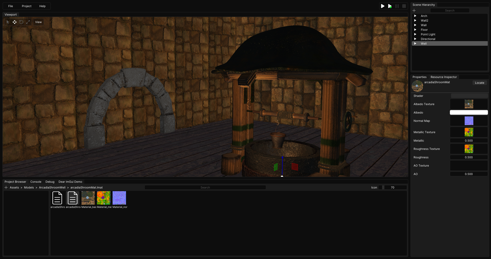

# Locus Game Engine

    
  <a style="font-size: 1.5em" href="https://locusengine.com">Website & Documentation</a>

Locus is an open-source, general-purpose 2D/3D game engine for Windows.

## Progress
Locus is still in early stages of development. Progress for Locus can be followed [here](https://trello.com/b/NNDPkCjF/locus-kanban).

## Core Features
- Integrated editor
- C# scripting
- PBR lighting & materials
- Custom mesh loading
- Sprite rendering
- Primitive shape rendering (Circles, Cubes)
- 2D physics
- 3D physics (WIP)
- UI rendering (WIP)
- Spritesheets (WIP)
- Skeletal animations (WIP)
- 2D particle system (WIP)
- Audio system (WIP)

## Locus Editor

  

## How to Build
#### Requirements
- Windows OS
- OpenGL 4.5 supported hardware
- Visual Studio 2022
- Python 3
- .NET SDK

#### 1. Downloading source code
- Run `git clone --recursive https://github.com/kyenel64/Locus-Engine` in the command prompt. Remember to include `--recursive` as Locus uses submodules.

#### 2. Run Scripts/Setup.bat
- Run Scripts/Setup.bat to install premake and generate a Visual Studio solution.
- IMPORTANT: Make sure 'Shader Toolchain Debug Symbols - 64-bit' is selected if the Vulkan pop-up opens.

#### 3. Build using Visual Studio
- Open Locus.sln
- Build solution. (Locus-Editor should be selected as the startup project).

#### 4. Running the engine editor
- The .exe file will be generated in bin/(Config)-windows-x86_64/Locus-Editor

#### Sample Project
- If you would like to run the sample project, import it through the Locus Launcher by selecting the .sln file in the project directory.

#### Note:
- Scripts in projects must be compiled manually for now. Build the VS solution within your project directory when making changes to scripts. 

## Dependencies
- [GLFW](https://github.com/glfw/glfw)
- [Glad](https://github.com/Dav1dde/glad)
- [premake](https://github.com/premake/premake-core)
- [VulkanSDK](https://www.vulkan.org/)
- [ImGui](https://github.com/ocornut/imgui)
- [Entt](https://github.com/skypjack/entt)
- [Box2D](https://github.com/erincatto/box2d)
- [glm](https://github.com/g-truc/glm)
- [ImGuizmo](https://github.com/CedricGuillemet/ImGuizmo)
- [mono](https://www.mono-project.com/)
- [spdlog](https://github.com/gabime/spdlog)
- [stb_image](https://github.com/nothings/stb)
- [yaml-cpp](https://github.com/jbeder/yaml-cpp)
